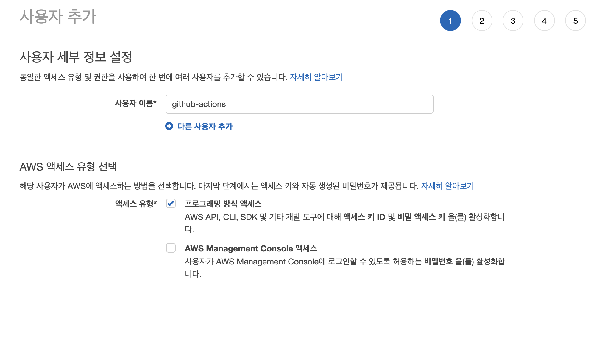
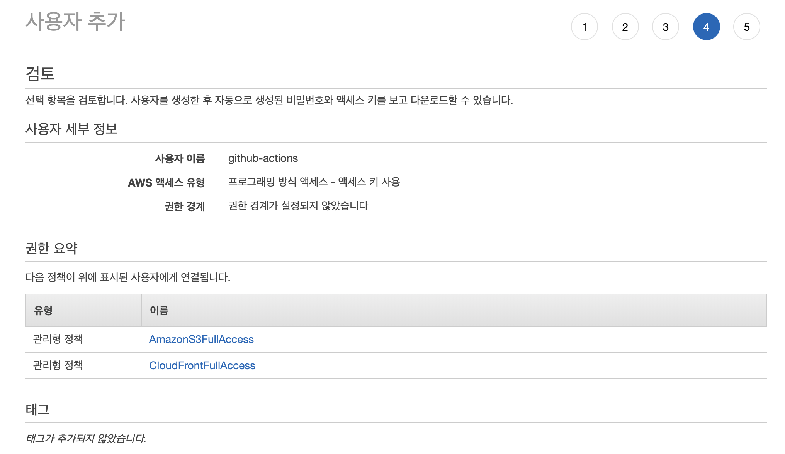
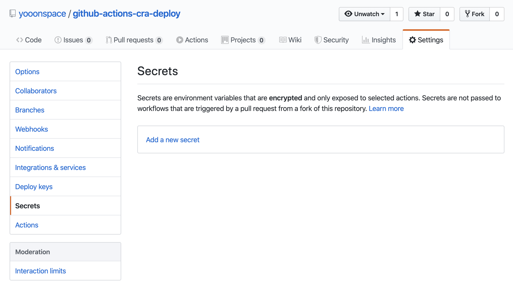
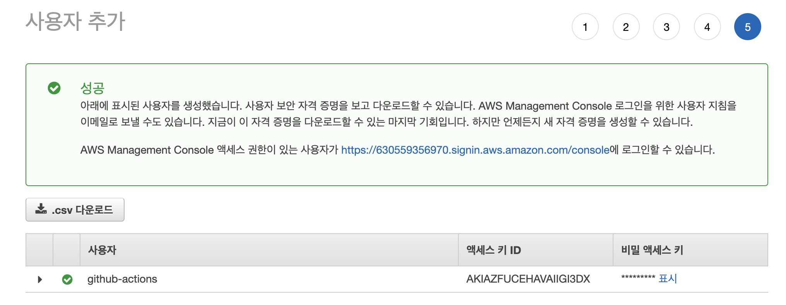
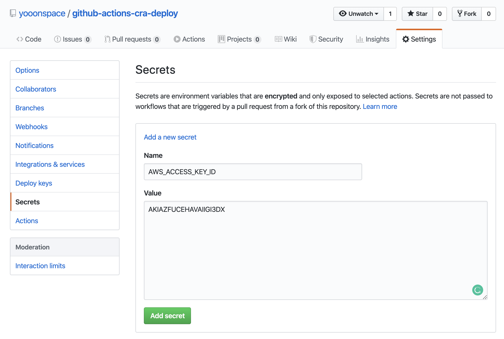

# CRA(Create React App) deploy on S3 & CloudFront with Github Actions

> Create React App으로 생성한 프로젝트를 AWS S3와 CloudFront에 배포를 자동화 시켜주는 Github Action 템플릿 파일입니다. 

## 사전준비
> 최초 배포는 수동 배포를 필요로 합니다. Velopert님의 [리액트 앱 AWS S3, CloudFront 에 배포하기](https://react-etc.vlpt.us/08.deploy-s3.html) 글을 참고해주세요.

## 사용방법

### 1. 준비
#### 1.1. `AWS Console > IAM`에 접속해서 `프로그래밍 방식 액세스 사용자를 추가합니다.


#### 1.2. `AmazonS3FullAccess`와 `CloudFrontFullAccess`권한을 추가해줍니다.



#### 1.3. 사용할 프로젝트의 `Github Repository > Setting > Secrets` 에서 `Add a new secret`을 클릭합니다.


#### 1.4. IAM에서 발급받은 액세스 키 ID와 비밀 액세스 키를 각각 `AWS_ACCESS_KEY_ID`와 `AWS_SECRET_ACCESS_KEY`로 저장해주세요.



### 2. Github Actions 설정
#### 2.1. `.github/workflows/template.yml` 파일을 수정해서 사용해주세요.
> S3 Bucket Name과 CloudFront Distribution ID가 필요합니다.

```yaml
name: CRA(Create React App) Build & deploy on AWS S3 + CloudFront invalidate
on:
  push:
    branches:
      - master

jobs:
  build:
    runs-on: ubuntu-18.04
    steps:
      - name: Checkout source code
        uses: actions/checkout@master

      - name: Install Dependencies
        uses: borales/actions-yarn@v2.0.0
        with:
          cmd: install

      - name: Build
        uses: borales/actions-yarn@v2.0.0
        with:
          cmd: build

      - name: Configure AWS credentials
        uses: aws-actions/configure-aws-credentials@v1
        with:
          aws-access-key-id: ${{ secrets.AWS_ACCESS_KEY_ID }}
          aws-secret-access-key: ${{ secrets.AWS_SECRET_ACCESS_KEY }}
          aws-region: ap-northeast-2

      - name: Deploy to S3
        run: |
          aws s3 cp \
            --recursive \
            --region ap-northeast-2 \
            build s3://your-s3-bucket-name                  # S3 Bucket Name

      - name: CloudFront Invalidate
        run: |
          aws cloudfront create-invalidation \
            --distribution-id your-distribution-id \        # CloudFront Distribution ID
            --paths / /index.html /service-worker.js /manifest.json /favicon.ico /robots.txt /logo192.png /logo512.png /asset-mainfest.json

```

## License
MIT License

Copyright 2019 Lee Seungmin. All rights reserved.

